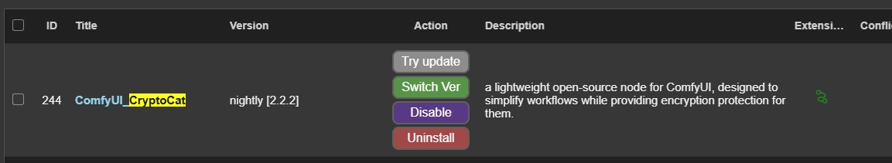

[Read English](ENGLISH_README.md)

# CryptoCat: ComfyUI压缩加密节点

## 简介
CryptoCat是一个小巧的ComfyUI开源节点，它的作用在于简化工作流，同时给工作流提供加密保护。

## 应用场景
- 流程简化：可以大幅度简化工作流。
- 加密授权：可以保护工作流里的一些核心思路。

## 快速开始
你可以在这里看到一个简单的 [Workflow Demo](demo/original.json)

### 安装和使用步骤
1. **安装节点**
   - 在 ComfyUI-Manager中搜索RiceRound，找到CryptoCat节点
  

   - 你也可以下载文件夹放入ComfyUI\custom_nodes目录

1. **启动和配置**
   - 启动 ComfyUI
   - 在菜单"高级"（advance）中找到 CryptoCat 目录

2. **🔐使用方法**
   - 加密组件和加密结束桥接一头一尾，控制工作流的加密区间
   - 随机种子会在服务端生成随机数，用于修补工作流封装后随机数不起效的情况

> ☘️ 解密组件无需手动添加 - 加密后系统会在output文件夹自动生成包含解密组件的工作流

> ☘️ 加密时会自动生成10组序列号，用户首次使用时会与硬件信息绑定，不够可以从设置里面找到算号器生成

  ## ⚠️易错强调

 

> ⚠️加密组件和加密结束桥接一头一尾！

> ⚠️输出节点连接不能遗漏！！

## 贡献指南
欢迎对CryptoCat项目做出贡献！你可以通过提交Pull Request或开设Issue来提出新功能建议或报告问题。

## 许可证
本项目遵循MIT许可证。有关详细信息，请参阅LICENSE文件。

## 联系方式
Email：<hzxhzx321@gmail.com>

---
CryptoCat © 2024. All Rights Reserved.
